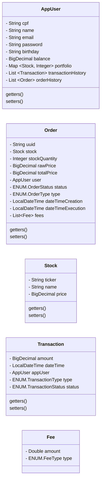

# Homebroker ADA-B3
### Projeto para o módulo Programação Web 2 do curso Back end em Java ADA B3+ inclua.

## Sobre o projeto

O Homebroker é uma API REST desenvolvida em Java com Spring boot. Foi desenvolvido para aplicar os conhecimentos adquiridos sobre Spring Boot, REST e aplicações web no geral.

Seu propósito é simular um sistema de corretagem online, onde os usuários podem gerenciar suas ações e fazer operações de compra e venda de ativos financeiros.

#### Desenvolvido pelos alunos [Juliana Barros](https://github.com/leialemon), [Nero Haziel](https://github.com/HepoHB) e Jebson Trindade.

## Usabilidade

> Este repositório possui um arquivo [JSON](Homebroker.postman_collection.json) com requisições do Postman que pode ser usadas para testar as funcionalidades da API. Bem como um [front-end minificado](miniFront) que desempenha as mesmas funções.

### Documentação OpenAPI 

 

 A documentação OpenAPI spec está disponível no link: https://leialemon.github.io/Homebroker-ADA-B3-Swagger/

# Detalhes técnicos

## Tecnologias utilizadas

    

### Outras ferramentas

- Para agilizar o desenvolvimento do código, utilizamos o [Mapstruct](https://mapstruct.org/) para mapear as transformações entre as entidades do banco de dados e seus DTOs. Adicionalmente, criamos manualmente a classe StockTickerMapper, de modo a alimentar o código gerado pelo Mapstruct com transformações específicas à nossas entidades. As classes de mapeamento estão salvas no pacote `mapper`.

- Utilizamos [H2](https://www.h2database.com/html/main.html) com JPA como banco de dados em memória.

- A documentação OpenAPI foi gerada com [Springdoc](https://springdoc.org/).

## Modelagem do projeto

O projeto foi modelado a partir do mapeamento das entidades-chave em um [diagrama EER](https://github.com/leialemon/Ada-Homebroker?tab=readme-ov-file#modelagem-de-dados) e em um [diagrama UML de classes](https://github.com/leialemon/Ada-Homebroker/blob/main/README.md#diagrama-de-classes), seguidos da implementação em código.

O padrão de design Strategy foi utilizado para gerenciar as regras de cálculo de preço de ordens e as modificações no saldo e portfolio do usuário. As classes que implementam este padrão estão no pacote `util`.

## Diagrama de classes 

## Modelagem de dados

        

