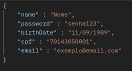
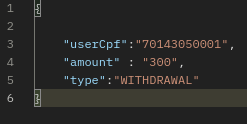
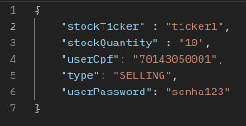
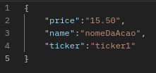
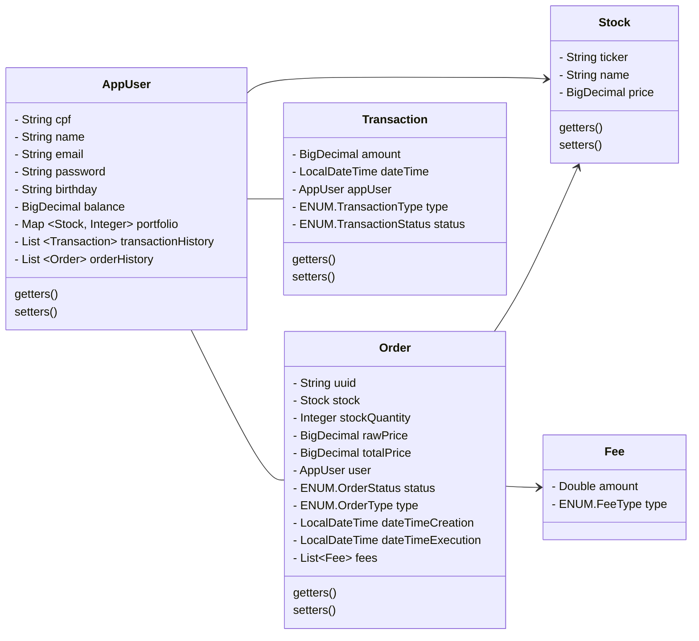

# 📊 Homebroker ADA-B3
### Projeto para o módulo Programação Web 2 do curso Back end em Java ADA B3+ inclua.

## Sobre o projeto

O Homebroker é uma API REST desenvolvida em Java com Spring boot. Foi desenvolvido para aplicar os conhecimentos adquiridos sobre Spring Boot, REST e aplicações web no geral.

Seu propósito é simular um sistema de corretagem online, onde os usuários podem gerenciar suas ações e fazer operações de compra e venda de ativos financeiros.

#### Desenvolvido pelos alunos [Juliana Barros](https://github.com/leialemon), [Nero Haziel](https://github.com/HepoHB) e Jebson Trindade.

## Usabilidade

> Este repositório possui um arquivo [JSON](Homebroker.postman_collection.json) com requisições do Postman que podem ser usadas para testar as funcionalidades da API, bem como um [front-end minificado](miniFront) que desempenha as mesmas funções.
> 

    

Para automatizar a execução da API com o miniFront, é possível utilizar um dos scripts disponíveis na pasta [scripts](scripts).

Os scripts atendem a dois tipos de shells (bash e powershell) e dois navegadores (google chrome e firefox). Basta escolher o mais apropriado e executá-lo.

#### AppUser
- GET : O endpoint `/api/v1/users` retorna a lista de todos os usuários cadastrados no banco de dados, enquanto o `/api/v1/users/cpf/{cpf}` retorna o usuário que possui o cpf buscado.
- PATCH : Não há um endpoint para requisições que alterem atributos do usuário, pois esses métodos são acessados apenas internamente pelas entidades de Order e Transaction.
- POST : Para criar um novo usuário, a requisição deve ser feita no endpoint `/api/v1/users` e conter no body os dados necessários. Não é possível criar mais de um usuário com o mesmo cpf e este deve ser válido. A criação de um usuário com idade inferior à 18 anos também é impedida pelo programa.

    

#### Transaction
- POST : Endpoint `/api/v1/transactions` com informações no corpo da requisição:

    

#### Order
- PATCH : Após ser criada, a ordem fica com status pendente e só irá porduzir efeitos se o usuário a confirmar através do método PATCH. Também é possível cancelá-la. É possível estabelecer um tempo após o qual a ordem expira automaticamente, caso não seja confirmada nem cancelada pelo usuário.
- POST : Endpoint `/api/v1/orders` com informações no corpo da requisição:

    

#### Stock
- GET : O endpoint `/api/v1/stocks` retorna todas as ações cadastradas enquanto o endpoint `api/v1/stocks/ticker/{ticker}` retorna apenas a ação correspondente ao ticker informado.
- PATCH : `/api/v1/stocks/alter/{ticker}/price?price={price}` Permite alterar o valor das ações.
- DELETE : O endpoint `/api/v1/stocks/delete/{ticker}` apaga do banco de dados a ação que possui o ticker informado.
- POST : O endpoint `/api/v1/stocks` com o método POST deve conter no corpo da requisição os atributos necessários para criar uma nova ação:

    

### Documentação OpenAPI 

 

 A documentação OpenAPI spec está disponível no link: https://leialemon.github.io/Homebroker-ADA-B3-Swagger/

# 🖥️ Detalhes técnicos

## Tecnologias utilizadas

    

### Outras ferramentas

- Para agilizar o desenvolvimento do código, utilizamos o [Mapstruct](https://mapstruct.org/) para mapear as transformações entre as entidades do banco de dados e seus DTOs. Adicionalmente, criamos manualmente a classe StockTickerMapper, de modo a alimentar o código gerado pelo Mapstruct com transformações específicas à nossas entidades. As classes de mapeamento estão salvas no pacote `mapper`.

- Utilizamos [H2](https://www.h2database.com/html/main.html) com JPA como banco de dados em memória.

- A documentação OpenAPI foi gerada com [Springdoc](https://springdoc.org/).

## Modelagem do projeto

O projeto foi modelado a partir do mapeamento das entidades-chave em um [diagrama EER](https://github.com/leialemon/Ada-Homebroker?tab=readme-ov-file#modelagem-de-dados) e em um [diagrama UML de classes](https://github.com/leialemon/Ada-Homebroker/blob/main/README.md#diagrama-de-classes), seguidos da implementação em código.

O padrão de design Strategy foi utilizado para gerenciar as regras de cálculo de preço de ordens e as modificações no saldo e portfolio do usuário. As classes que implementam este padrão estão no pacote `util`.

### Exceções customizadas

Criamos 4 exceções Runtime customizadas para maior transparência acerca dos processos do programa.

- EntityNotFoundException : lançada quando é feita uma busca específica por uma entidade que não existe no banco. Torna o código 404 mais legível ao cliente.
- IncorrectPassword : lançada quando uma requisição POST de Order é feita com a senha incorreta para o usuário informado. Retorna o código de status 401.
- IsAMinorException : lançada quando se tenta cadastrar um usuário com idade inferior a 18 anos.
- NotEnoughFundsException : lançada quando se tenta fazer uma Transaction de saque ou um Order de compra sem possuir o saldo necessário.

## Diagrama de classes 

## Modelagem de dados

        

