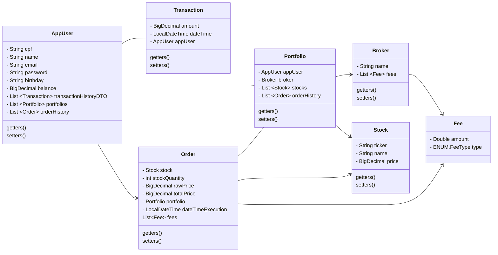
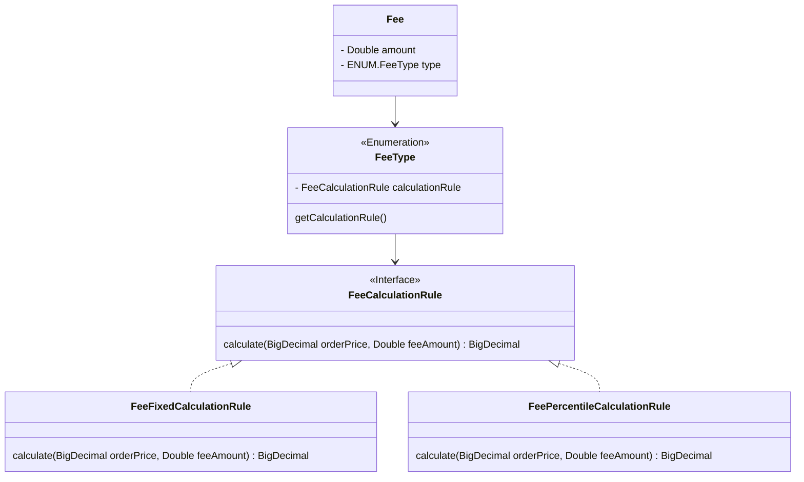
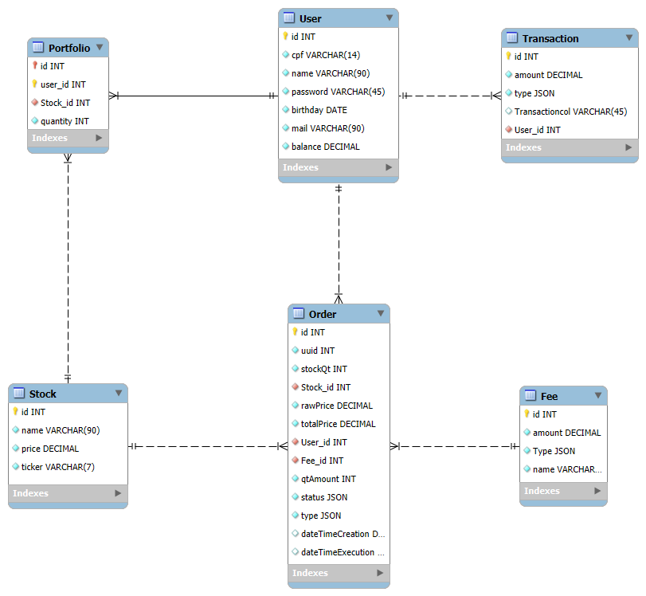

# 🛠️ (Em andamento) Projeto para o módulo Programação Web 2 do curso Back end em Java ADA B3+ inclua.
## Tecnologias utilizadas
<p align="center">
    <a href="https://skillicons.dev">
        
    </a>
</p>

## Documentação OpenAPI 

 <p> A documentação OpenAPI spec está disponível no link: https://leialemon.github.io/Homebroker-ADA-B3-Swagger/</p>

## Diagrama de classes 


## Implementação de diferentes regras de cálculo para cada Fee


## CRC Cards

```mermaid
classDiagram
direction RL
namespace ModelCRCCards{
    class UserCRC
    class OrderCRC
    class PortfolioCRC
    class TransactionCRC
    class BrokerCRC
    class StockCRC
}

namespace UserCRC{
    class UserResponsibiliy{
        Represents the appUser of the system. \n It's the starting point for most of the processes 
    }
    class UserCollaboration{
        Portfolio
        Transaction
        Order
    }
}

namespace OrderCRC{
    class OrderResponsibiliy{
        Represents the appUser's orders. \n Manages the contents of a portfolio.
    }
    class OrderCollaboration{
        Portfolio
        Stock
    }
}

namespace PortfolioCRC{
    class PortfolioResponsibiliy{
        Created when an appUser adds a broker. \n Contains Stocks. \n All orders must be placed from a portfolio.
    }
    class PortfolioCollaboration{
        Broker
        User
        Order
        Stock
    }
}

namespace TransactionCRC{
    class TransactionResponsibiliy{
        Modifies an appUser's balance.
    }
    class TransactionCollaboration{
        User
    }
}

namespace BrokerCRC{
    class BrokerResponsibiliy{
        Represents the brokerage firms through which \n the appUser places the orders. \n Creates an unique portfolio for the appUser. \n Defines if fees are charged in an order \n and their amounts.
    }
    class BrokerCollaboration{
        Portfolio
    }
}

namespace StockCRC{
    class StockResponsibiliy{
        The negotiable asset. \n Contains the price that will inform \n if an automatic order will trigger.
    }
    class StockCollaboration
}
```

## Modelagem de dados

<p align="center">
    
</p>

## Padrões e escolhas de design
